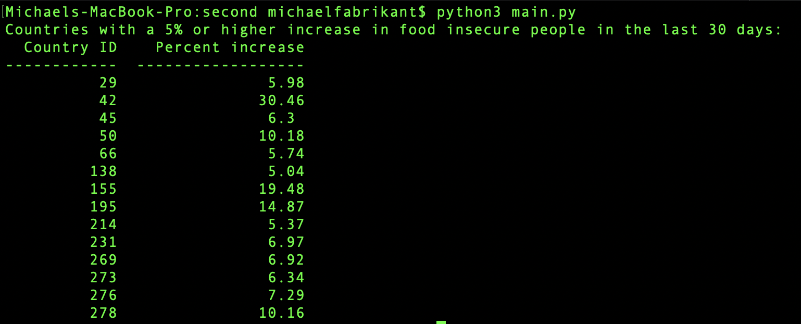

# VAM test II

Code in this repository merely fetches data from API endpoints and prints out the IDs of countries whose contacts should be alerted, based on the criteria of the test. There are no automated tests, error handling, nor lint, and comments are sparse.

Also missing, is code to email the appropriate recipients, and a scheduling mechanism like cron or jenkins to run the program daily.

I only had a few scattered hours to focus on this. For a more solid VAM test submission, please see [this](https://medium.com/@mikefabrikant/software-engineer-technical-test-submission-c2c70ff52a51) test which I submitted last August.

## Run
- Clone this repo
- rename config-sample.json to config.json
- set API endpoints in config
- `pip3 install -r requirements.txt`
- `python3 main.py`

## Run in test mode option
In order to group all regions by country, I query an endpoint 4k+ times, once per region. During this process, a data structure is gradually created. To run this program with archived data:
- `python3 main.py test`

## Expected output

